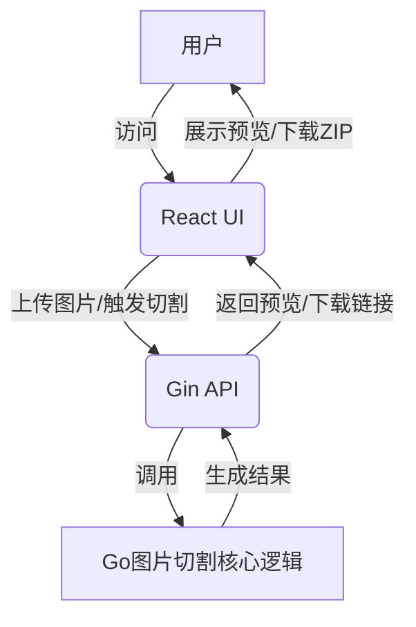

# 图集切割工具UI交互界面设计方案与任务列表

## 1. 整体架构设计

本项目将采用前后端分离的架构，后端使用Go语言的Gin框架提供API服务，前端使用React框架构建用户交互界面。

-   **后端 (Gin)**: 负责接收图片上传、调用核心图片切割逻辑、生成切割结果（图片、CSS、JSON）并打包为ZIP文件供下载。
-   **前端 (React)**: 负责用户界面的展示、图片选择与上传、切割预览、触发切割操作以及下载切割结果。

## 2. 后端 (Gin) API设计

### 2.1 API 接口

-   **POST /upload**: 图片上传接口
    -   **请求**: `multipart/form-data`，包含图片文件。
    -   **响应**: 上传成功后返回图片信息（如临时路径、尺寸）或预览数据。

-   **POST /process**: 图片切割接口
    -   **请求**: `application/json`，包含图片标识（如临时文件路径）。
    -   **响应**: 切割成功后返回切割结果的下载链接（ZIP文件）。

-   **GET /download/:filename**: 文件下载接口
    -   **请求**: URL参数 `filename` 为待下载的ZIP文件名。
    -   **响应**: 返回ZIP文件流。

### 2.2 后端逻辑

1.  **图片上传**: 接收用户上传的PNG图片，保存到临时目录。
2.  **图片处理**: 调用 `main.go` 中已有的 `getSprites`、`getCSS`、`getJson`、`saveSprite` 等核心函数进行图片切割和文件生成。
3.  **结果打包**: 将切割后的所有小图、CSS文件和JSON文件打包成一个ZIP文件。
4.  **文件清理**: 在文件下载后或一定时间后清理临时文件。

## 3. 前端 (React) UI设计

### 3.1 页面布局

-   **头部**: 应用标题。
-   **图片上传区域**: 
    -   文件选择按钮。
    -   拖拽上传区域。
    -   显示已选择的文件名。
-   **预览区域**: 
    -   显示上传的原始图片。
    -   在原始图片上叠加显示切割后的精灵框（可选，如果后端能返回坐标信息）。
-   **操作区域**: 
    -   “开始切割”按钮。
    -   “下载结果”按钮（切割完成后显示）。
-   **状态/消息区域**: 显示上传进度、切割状态、错误信息等。

### 3.2 交互流程

1.  用户通过点击按钮或拖拽上传PNG图片。
2.  前端将图片发送到后端 `/upload` 接口。
3.  后端保存图片并返回成功信息。
4.  前端在预览区域显示上传的图片。
5.  用户点击“开始切割”按钮。
6.  前端发送请求到后端 `/process` 接口。
7.  后端执行切割、生成文件、打包ZIP。
8.  后端返回ZIP文件的下载链接。
9.  前端显示“下载结果”按钮，用户点击即可下载ZIP包。

## 4. 任务列表

### 4.1 后端开发任务 (Gin)

-   [ ] 初始化Gin项目。
-   [ ] 实现图片上传API (`POST /upload`):
    -   接收 `multipart/form-data`。
    -   保存上传的PNG文件到临时目录。
    -   返回上传成功信息。
-   [ ] 实现图片切割API (`POST /process`):
    -   接收图片标识（如临时文件路径）。
    -   集成现有 `main.go` 中的图片切割核心逻辑。
    -   将切割结果（小图、CSS、JSON）保存到指定输出目录。
    -   将输出目录打包成ZIP文件。
    -   返回ZIP文件的下载链接。
-   [ ] 实现文件下载API (`GET /download/:filename`):
    -   根据文件名提供ZIP文件下载。
-   [ ] 实现临时文件清理机制（例如，定时任务或下载后删除）。
-   [ ] 错误处理和日志记录。

### 4.2 前端开发任务 (React)

-   [ ] 初始化React项目。
-   [ ] 设计并实现主页面布局。
-   [ ] 开发图片上传组件:
    -   文件选择输入框 (`<input type="file">`)。
    -   拖拽上传功能。
    -   显示已选择的文件名和上传状态。
    -   调用后端 `/upload` API。
-   [ ] 开发图片预览组件:
    -   显示上传的原始图片。
    -   （可选）根据后端返回的坐标信息，在预览图上绘制精灵框。
-   [ ] 开发操作按钮组件:
    -   “开始切割”按钮，调用后端 `/process` API。
    -   “下载结果”按钮，在切割完成后显示，点击调用 `/download` API。
-   [ ] 状态和消息提示组件（如使用Toast或Modal）。
-   [ ] 样式设计 (CSS/SCSS/Styled Components)。
-   [ ] 响应式布局考虑。

### 4.3 联调与测试

-   [ ] 前后端联调，确保API通信正常。
-   [ ] 编写单元测试和集成测试。
-   [ ] 性能优化和用户体验改进。

### 4.4 部署

-   [ ] 编写部署文档。
-   [ ] 容器化 (Docker)（可选）。